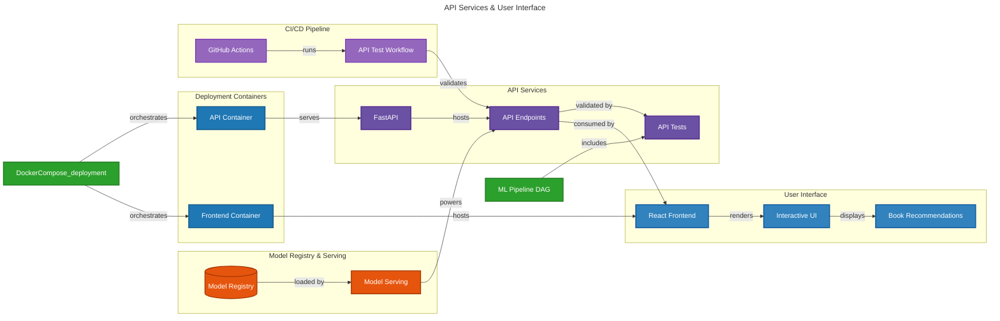
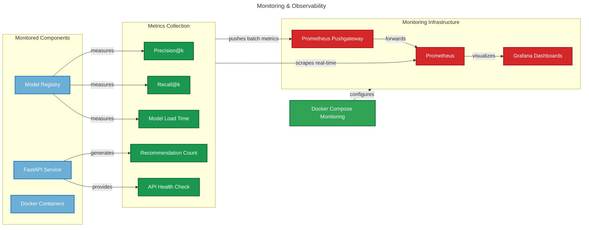
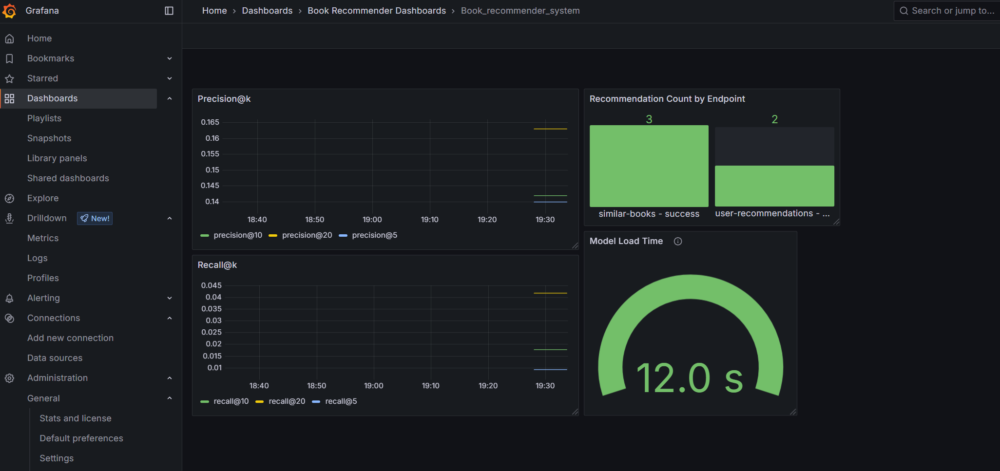

# MLOps Book Recommender System

This project is a Book Recommender System using Collaborative Filtering. It's designed with MLOps principles to provide a streamlined, production-ready recommendation system with automated workflows, monitoring, and scalable deployment.


## Project Organization
------------

    ├── LICENSE
    ├── README.md          <- The top-level README for developers using this project.
    ├── setup.py           <- Makes project pip installable (pip install -e .)
    ├── requirements.txt   <- The requirements file for reproducing the analysis environment
    ├── dvc.lock           <- Data Version Control lock file
    ├── dvc.yaml           <- Data Version Control configuration
    │
    ├── airflow            <- Airflow configuration for workflow orchestration
    │   ├── dags           <- Airflow DAG definitions
    │   ├── logs           <- Airflow logs
    │   └── plugins        <- Airflow plugins
    │
    ├── config             <- Configuration files
    │   └── model_params.yaml <- Model parameters configuration
    │
    ├── data
    │   ├── features       <- Features extracted from processed data
    │   ├── processed      <- The final, canonical data sets for modeling
    │   ├── raw            <- The original, immutable data dump
    │   └── results        <- Results from model evaluations and predictions
    │
    ├── docker             <- Docker configuration for containerized deployment
    │   ├── airflow        <- Airflow container configuration
    │   ├── data-processing <- Data processing container configuration
    │   ├── data-retrieval  <- Data retrieval container configuration
    │   ├── dvc            <- DVC container configuration
    │   ├── fastAPI        <- FastAPI container configuration
    │   ├── frontend       <- Frontend container configuration
    │   ├── huggingface    <- Huggingface container configuration
    │   ├── model-training <- Model training container configuration
    │   └── monitoring     <- Monitoring container configuration
    │
    ├── docs               <- Documentation files
    │   └── architecture.md <- Architecture design documentation
    │
    ├── flask              <- Flask web application
    │   ├── backend        <- Flask backend API
    │   ├── frontend       <- Flask frontend templates
    │   └── logs           <- Flask application logs
    │
    ├── frontend           <- React frontend application
    │   ├── package.json   <- Frontend dependencies
    │   ├── public         <- Static files
    │   └── src            <- Frontend source code
    │
    ├── graphs             <- Generated visualization files
    │   ├── airflow_chart.mmd         <- Airflow workflow chart
    │   ├── dvc.png                   <- DVC workflow visualization
    │   ├── Frontend_book.png         <- Frontend book interface screenshot
    │   ├── Grafana_monitoring.png    <- Grafana dashboard screenshot
    │   ├── mlops_api_ui_deployment.mmd <- API & UI deployment diagram
    │   ├── mlops_architecture.mmd    <- Overall architecture diagram
    │   ├── mlops_data_model_pipeline.mmd <- Data & model pipeline diagram
    │   └── mlops_monitoring.mmd      <- Monitoring architecture diagram
    │
    ├── logs               <- Logs from training, API, and other components
    │
    ├── mlruns             <- MLflow experiment tracking data
    │   ├── 0              <- MLflow run data
    │   └── models         <- MLflow model registry
    │
    ├── models             <- Trained and serialized models
    │
    ├── notebooks          <- Jupyter notebooks for exploration and analysis
    │
    ├── src                <- Source code for use in this project
    │   ├── __init__.py    <- Makes src a Python module
    │   ├── config         <- Configuration utilities
    │   ├── metrics.py     <- Metrics collection utilities
    │   │
    │   ├── data           <- Scripts to download or generate data
    │   │   ├── __init__.py
    │   │   ├── check_structure.py    <- Validate data structure
    │   │   ├── retrieve_raw_data.py  <- Download raw datasets
    │   │   ├── process_data.py       <- Process and clean data
    │   │   └── logs                  <- Data processing logs
    │   │
    │   ├── features       <- Scripts to turn raw data into features for modeling
    │   │   ├── __init__.py
    │   │   └── build_features.py     <- Feature engineering pipeline
    │   │
    │   ├── fastAPI        <- FastAPI web service
    │   │   ├── api.py              <- API endpoints definition
    │   │   ├── test_api_pytest.py  <- API tests
    │   │   └── logs                <- API service logs
    │   │
    │   ├── models         <- Scripts to train models and make predictions
    │   │   ├── __init__.py
    │   │   ├── train_model.py      <- Model training scripts
    │   │   ├── predict_model.py    <- Model prediction scripts
    │   │   ├── evaluate_model.py   <- Model evaluation utilities
    │   │   ├── model_utils.py      <- Model utility functions
    │   │   ├── mlflow_utils.py     <- MLflow integration utilities
    │   │   ├── test_model.py       <- Model tests
    │   │   └── logs                <- Model training and prediction logs
    │   │
    │   ├── mcp            <- Model Context Protocol implementation
    │   │   ├── __init__.py
    │   │   ├── mcp_client.py       <- MCP client implementation
    │   │   └── mcp_server.py       <- MCP server implementation
    │   │
    │   └── monitoring     <- Monitoring and observability utilities
    │
    ├── streamlit          <- Streamlit dashboard application
    │   ├── src            <- Streamlit source code
    │   │   ├── assets     <- Static assets for Streamlit app
    │   │   └── streamlit_app.py <- Main Streamlit application
    │   ├── Dockerfile     <- Streamlit container configuration
    │   └── requirements.txt <- Streamlit app dependencies
    │
    └── docker-compose files <- Multiple docker-compose files for different deployment scenarios:
        ├── docker-compose.airflow.yml      <- Airflow services
        ├── docker-compose.api-frontend-local.yml <- API and frontend for local development
        ├── docker-compose.data-pipeline.yml <- Data pipeline services
        ├── docker-compose.deploy-local.yml  <- Full local deployment
        ├── docker-compose.dvc.yml           <- DVC operations
        ├── docker-compose.monitoring.yml    <- Prometheus and Grafana monitoring
        └── docker-compose.train.yml         <- Model training services

--------

## Architecture Overview

This recommender system uses collaborative filtering to provide personalized book recommendations. Collaborative filtering works by analyzing user-item interactions (in this case, book ratings) to identify patterns and similarities between users and/or items.

The project follows MLOps best practices with a complete end-to-end pipeline as illustrated below:

```mermaid
flowchart LR
    %% MLOps Architecture for Book Recommender System
    %% Based on actual tools used in the codebase

    %% Main Components Definition
    subgraph DataLayer["Data Management"]
        direction TB
        RawData[("Raw Book Data")]
        ProcessedData[("Processed Data")]
        FeatureData[("Feature Matrices")]
        DVC["DVC - Data Versioning"]
        DAGsHub["DAGsHub"]
    end

    subgraph ModelLayer["Model Development"]
        direction TB
        FeatureEng["Feature Engineering"]
        Training["Model Training"]
        MLflow["MLflow - Experiment Tracking"]
        ModelRegistry[("Model Registry")]
        Evaluation["Model Evaluation"]
    end

    subgraph APILayer["API Services"]
        direction TB
        FastAPI["FastAPI"]
        ModelServing["Model Serving"]
        APIEndpoints["API Endpoints"]
        APITests["API Tests"]
    end

    subgraph UILayer["User Interface"]
        direction TB
        React["React Frontend"]
        UserInterface["Interactive UI"]
        Recommendations["Book Recommendations"]
    end

    subgraph CILayer["CI/CD"]
        direction TB
        GitHubActions["GitHub Actions"]
        DVCPush["DVC Push Workflow"]
        APITest["API Test Workflow"]
    end

    subgraph AirflowLayer["Workflow Orchestration"]
        direction TB
        AirflowCoordination["Airflow Coordination"]
        PipelineDAG["ML Pipeline DAG"]
        MonitoringDAG["Monitoring DAG"]
    end

    subgraph Monitoring["Monitoring & Observability"]
        direction LR
        Prometheus["Prometheus"]
        Grafana["Grafana Dashboards"]
        Pushgateway["Pushgateway"]
        Metrics["Metrics Collection"]
    end

    %% Data flow relationships
    RawData -->|versioned| DVC
    DVC -->|syncs with| DAGsHub
    DVC -->|provides| ProcessedData
    ProcessedData -->|input for| FeatureEng
    FeatureEng -->|creates| FeatureData
    FeatureData -->|feeds| Training
    Training -->|logs metrics| MLflow
    Training -->|produces| ModelRegistry
    ModelRegistry -->|evaluated by| Evaluation
    ModelRegistry -->|loaded by| ModelServing
    ModelServing -->|powers| APIEndpoints
    APIEndpoints -->|validated by| APITests
    FastAPI -->|hosts| APIEndpoints
    APIEndpoints -->|consumed by| React
    React -->|renders| UserInterface
    UserInterface -->|displays| Recommendations

    %% CI/CD relationships
    GitHubActions -->|triggers| DVCPush
    GitHubActions -->|runs| APITest
    DVCPush -->|updates| DAGsHub
    APITest -->|validates| APIEndpoints

    %% Simplified Airflow orchestration
    AirflowCoordination -->|manages| PipelineDAG
    AirflowCoordination -->|manages| MonitoringDAG
    
    %% Pipeline DAG connections
    PipelineDAG -->|orchestrates data pipeline| DataLayer
    PipelineDAG -->|orchestrates modeling| ModelLayer
    PipelineDAG -->|validates| APITests
    
    %% Monitoring DAG connections
    MonitoringDAG -->|tracks| ModelRegistry
    MonitoringDAG -->|collects metrics| Metrics

    %% Monitoring relationships
    APIEndpoints -->|emit metrics| Metrics
    Evaluation -->|pushes metrics| Pushgateway
    Pushgateway -->|forwards to| Prometheus
    Metrics -->|collected by| Prometheus
    Prometheus -->|visualized in| Grafana

    %% Styling with distinct colors for each component
    classDef data fill:#2a9d2a,stroke:#1a661a,stroke-width:2px,color:white
    classDef model fill:#e6550d,stroke:#a63603,stroke-width:2px,color:white
    classDef api fill:#6a51a3,stroke:#54278f,stroke-width:2px,color:white
    classDef ui fill:#3182bd,stroke:#08519c,stroke-width:2px,color:white
    classDef cicd fill:#e377c2,stroke:#c51b8a,stroke-width:2px,color:white
    classDef airflow fill:#20c997,stroke:#138570,stroke-width:2px,color:white
    classDef monitoring fill:#d62728,stroke:#a50f15,stroke-width:2px,color:white

    %% Apply styles
    class RawData,ProcessedData,FeatureData,DVC,DAGsHub data
    class FeatureEng,Training,MLflow,ModelRegistry,Evaluation model
    class FastAPI,ModelServing,APIEndpoints,APITests api
    class React,UserInterface,Recommendations ui
    class GitHubActions,DVCPush,APITest cicd
    class AirflowCoordination,PipelineDAG,MonitoringDAG airflow
    class Prometheus,Grafana,Pushgateway,Metrics monitoring
```



### Key Components

- **Data Management Pipeline**: Automated data ingestion, processing, and versioning with DVC
- **Model Development**: Collaborative filtering implementation with standardized training workflows
- **API Services**: FastAPI-based prediction service with RESTful endpoints
- **React Frontend**: User-friendly interface for book recommendations
- **Monitoring & Observability**: Prometheus and Grafana dashboards for system monitoring
- **Workflow Orchestration**: Airflow DAGs for automated pipeline execution
- **CI/CD Pipeline**: Containerized deployment with Docker and Docker Compose

## Component Details

### 1. Data Management Pipeline

The data pipeline handles the acquisition, processing, and versioning of book and rating datasets:

```mermaid
---
title: Data Flow & Model Development Pipeline
---
flowchart LR
    %% Data Flow and Model Development Pipeline
    %% This diagram focuses on the data and model aspects of the MLOps architecture

    %% Data Management
    subgraph DataLayer["Data Management"]
        direction TB
        RawData[("Raw Book Data")]
        ProcessedData[("Processed Data")]
        FeatureData[("Feature Matrices")]
        DVC["DVC - Data Versioning"]
        DAGsHub["DAGsHub"]
    end

    %% Model Development
    subgraph ModelLayer["Model Development"]
        direction TB
        FeatureEng["Feature Engineering"]
        Training["Model Training"]
        MLflow["MLflow - Experiment Tracking"]
        ModelRegistry[("Model Registry")]
        Evaluation["Model Evaluation"]
    end

    %% Workflow Orchestration for Data & Model Pipeline
    subgraph DataModelOrc["Pipeline Orchestration"]
        direction TB
        PipelineDAG["ML Pipeline DAG"]
        DVCContainer["DVC Container"]
        DataRetrieval["Data Retrieval Container"]
        DataIngestion["Data Ingestion Container"]
        ModelTraining["Model Training Container"]
    end

    %% Data flow relationships
    RawData -->|versioned| DVC
    DVC -->|syncs with| DAGsHub
    DVC -->|provides| ProcessedData
    ProcessedData -->|input for| FeatureEng
    FeatureEng -->|creates| FeatureData
    FeatureData -->|feeds| Training
    Training -->|logs metrics| MLflow
    Training -->|produces| ModelRegistry
    ModelRegistry -->|evaluated by| Evaluation

    %% Orchestration relationships
    PipelineDAG -->|orchestrates| DataRetrieval
    DataRetrieval -->|processes| RawData
    PipelineDAG -->|orchestrates| DataIngestion
    DataIngestion -->|creates| ProcessedData
    DataIngestion -->|builds| FeatureData
    PipelineDAG -->|orchestrates| ModelTraining
    ModelTraining -->|runs| Training
    ModelTraining -->|updates| ModelRegistry
    DVCContainer -->|manages| DVC

    %% GitHub Actions
    GitHubActions["GitHub Actions"]
    DVCPush["DVC Push Workflow"]
    GitHubActions -->|triggers| DVCPush
    DVCPush -->|updates| DAGsHub

    %% Styling
    classDef data fill:#2a9d2a,stroke:#1a661a,stroke-width:2px,color:white
    classDef model fill:#e6550d,stroke:#a63603,stroke-width:2px,color:white
    classDef orchestration fill:#2ca02c,stroke:#217821,stroke-width:2px,color:white
    classDef cicd fill:#9467bd,stroke:#7b3ab7,stroke-width:2px,color:white

    %% Apply styles
    class RawData,ProcessedData,FeatureData,DVC,DAGsHub data
    class FeatureEng,Training,MLflow,ModelRegistry,Evaluation model
    class PipelineDAG,DVCContainer,DataRetrieval,DataIngestion,ModelTraining orchestration
    class GitHubActions,DVCPush cicd
```



Key features:
- **Automated Data Ingestion**: Scripts for importing raw book and rating data
- **Data Processing**: Cleaning, transformation, and feature extraction
- **Data Versioning**: DVC integration for tracking data changes
- **Docker Containerization**: Isolated environment for data processing tasks

#### Data Pipeline Components:
- Data retrieval: `src/data/import_raw_data.py`
- Data processing: `src/data/process_data.py`
- Feature engineering: `src/features/build_features.py`

### 2. Model Development

The model development pipeline implements collaborative filtering techniques to provide personalized book recommendations:

Features:
- **Collaborative Filtering Models**: User-based and item-based recommendation approaches
- **Model Training Pipeline**: Standardized training workflows with hyperparameter tuning
- **Model Evaluation**: Comprehensive metrics for recommendation quality
- **Model Registry**: Version control for trained models using DVC

#### Model Components:
- Model training: `src/models/train_model.py`, `src/models/train_model_collaborative.py`
- Prediction service: `src/models/predict_model.py`
- Model configuration: `config/model_params.yaml`

### 3. API Services & Frontend

The API layer provides RESTful endpoints for interacting with the recommendation system, while the React frontend offers a user-friendly interface:



#### API Services Features:
- **FastAPI Backend**: High-performance API for recommendation requests
- **Swagger Documentation**: Interactive API documentation
- **Containerized Deployment**: Docker-based deployment for API services
- **Logging and Monitoring**: Structured logging and performance tracking

#### API Endpoints:
- `/docs`: Interactive API documentation
- `/recommend/user/{user_id}`: Get personalized book recommendations for a user
- `/similar-books/{book_id}`: Get similar books to a specific book

#### Frontend Features:
- **Responsive Design**: Mobile-friendly user interface
- **Book Search**: Search functionality for finding specific books
- **Recommendation Display**: Visual presentation of recommended books
- **User Interaction**: Rating and feedback mechanisms

### 5. Monitoring & Observability

Comprehensive monitoring and observability stack for tracking system performance:



Key components:
- **Prometheus Metrics**: Collection of service metrics
- **Grafana Dashboards**: Visualization of system performance
- **Alerts Configuration**: Automated alerting for system issues
- **Performance Tracking**: Monitoring of API response times and resource usage



### 6. Workflow Orchestration (Airflow)

Apache Airflow manages the orchestration of data and model workflows:

- **DAG Definitions**: Structured workflow definitions in `airflow/dags/`
- **Task Scheduling**: Automated execution of pipeline components
- **Dependency Management**: Handling of task dependencies
- **Failure Handling**: Robust error handling and retries

The project includes two main Airflow DAGs:
- `book_recommender_pipeline_dag.py`: Orchestrates the complete ML pipeline including data retrieval, processing, feature engineering, model training, and evaluation
- `book_recommender_monitoring_dag.py`: Handles monitoring of the production system metrics

### 7. CI/CD Pipeline

Continuous Integration and Deployment pipeline for automated testing and deployment:
The project uses GitHub Actions workflows:
- `api-test.yml`: Runs automated tests for the FastAPI endpoints
- `dvc-push.yml`: Automatically pushes data and model updates to DAGsHub when DVC files change


## Setup and Execution Instructions

### Development Environment Setup

```bash
# Clone the repository
git clone https://github.com/yourusername/MLOps_book_recommender_system.git
cd MLOps_book_recommender_system

# Create a virtual environment
python -m venv venv
source venv/bin/activate  # On Windows: .\venv\Scripts\activate

# Install dependencies
pip install -r requirements.txt
```

### Data Pipeline Execution

```bash
# Import raw data
python src/data/import_raw_data.py

# Process data
python src/data/process_data.py

# Generate features
python src/features/build_features.py
```

### Model Training and Evaluation

```bash
# Train the collaborative filtering model
python src/models/train_model.py

# Evaluate model performance
python src/models/predict_model.py
```

### Running the API and Frontend

```bash
# Start the FastAPI service
uvicorn src.api.api:app --reload

# In a separate terminal, start the React frontend
cd frontend
npm install
npm start
```

The API will be available at http://localhost:8000 with interactive documentation at http://localhost:8000/docs.
The frontend will be available at http://localhost:3000.

### Setting up Monitoring with Prometheus/Grafana

```bash
# Start the monitoring stack
docker-compose -f docker-compose.monitoring.yml up -d
```

Access Grafana dashboards at http://localhost:3000 with default credentials (admin/admin).

### Using Airflow for Workflow Orchestration

```bash
# Start the Airflow services
docker-compose -f docker-compose.airflow.yml up -d
```

Access the Airflow UI at http://localhost:8080 to monitor and trigger workflows.

### Running the Full Pipeline with Airflow

The complete data processing, model training, and API deployment pipeline is orchestrated through Airflow DAGs:

```bash
# Navigate to the Airflow UI after starting Airflow services
# Then trigger the book_recommender_pipeline_dag
```

### Docker Deployment

Deploy the entire system using Docker Compose:

```bash
# Build and start all services
docker-compose -f docker-compose.data-pipeline.yml -f docker-compose.train.yml -f docker-compose.deploy-local.yml -f docker-compose.monitoring.yml up -d
```


### Setting Up DVC for DAGsHub Authentication

This repository uses DVC to manage data and models with remote storage on DAGsHub.
You can work with DVC either locally or using the provided Docker container.

#### Option 1: Using DVC Locally

1. **Install DVC (if not installed)**
```bash
pip install dvc
```

2. **Set Up DAGsHub Authentication**
Generate a personal access token from DAGsHub Settings,
then configure DVC authentication locally:

```bash
dvc remote modify origin --local auth basic
dvc remote modify origin --local user <your-dagshub-username>
dvc remote modify origin --local password <your-dagshub-token>
```

⚠️ **Important**: This stores your credentials locally in `.dvc/config.local`, which is ignored by Git.

3. **Verify Your Config**
```bash
cat .dvc/config.local
```

4. **Pull or Push Data**
```bash
dvc pull
dvc push
```

#### Option 2: Using Docker Compose for DVC Operations

For isolated and consistent DVC operations, you can use the provided Docker container:

1. **Create an .env file with DAGsHub credentials**
```bash
# Create .env file with your credentials
echo "DAGSHUB_USER=your-username" > .env
echo "DAGSHUB_TOKEN=your-token" >> .env
```

2. **Run DVC commands using Docker Compose**
```bash
# Pull data and models from the remote repository
docker-compose -f docker-compose.dvc.yml run --rm dvc dvc pull

# Push data and models to the remote repository
docker-compose -f docker-compose.dvc.yml run --rm dvc dvc push

# Run other DVC commands
docker-compose -f docker-compose.dvc.yml run --rm dvc dvc status
docker-compose -f docker-compose.dvc.yml run --rm dvc dvc repro
```

This approach ensures consistent DVC operations across different environments and doesn't require local DVC installation.

## Docker Deployment

This project supports deployment using Docker and Docker Compose for containerized execution across multiple services:

### Docker Compose Configuration

The system uses multiple Docker Compose files to separate concerns:
- `docker-compose.data-pipeline.yml`: Data processing pipeline
- `docker-compose.train.yml`: Model training services
- `docker-compose.deploy-local.yml`: API and frontend deployment
- `docker-compose.monitoring.yml`: Prometheus and Grafana monitoring
- `docker-compose.airflow.yml`: Airflow workflow orchestration
- `docker-compose.dvc.yml`: Data Version Control operations

### Build and Run Services

```bash
# Build all Docker images
docker-compose -f docker-compose.data-pipeline.yml -f docker-compose.train.yml -f docker-compose.deploy-local.yml -f docker-compose.monitoring.yml -f docker-compose.airflow.yml build

# Start specific components
docker-compose -f docker-compose.data-pipeline.yml up -d  # Data pipeline only
docker-compose -f docker-compose.train.yml up -d          # Model training only
docker-compose -f docker-compose.deploy-local.yml up -d   # API and frontend only
docker-compose -f docker-compose.monitoring.yml up -d     # Monitoring only
docker-compose -f docker-compose.airflow.yml up -d        # Airflow only
docker-compose -f docker-compose.dvc.yml up -d            # DVC operations

# Stop all services
docker-compose -f docker-compose.data-pipeline.yml -f docker-compose.train.yml -f docker-compose.deploy-local.yml -f docker-compose.monitoring.yml -f docker-compose.airflow.yml down
```

### Service Architecture

The containerized services include:
- **Data Services**: Data retrieval, processing, and feature engineering
- **Model Services**: Model training, evaluation, and registry
- **API Services**: FastAPI-based recommendation endpoints
- **Frontend**: React-based user interface
- **Monitoring**: Prometheus metrics collection and Grafana dashboards
- **Orchestration**: Airflow for workflow management
- **DVC Service**: Data and model version control with DAGsHub integration

## Additional Resources

- [Architecture Documentation](docs/architecture.md): Detailed architecture design
- [Frontend Documentation](frontend/README.md): React frontend details
- [API Documentation](http://localhost:8000/docs): Interactive API documentation (when running)
- [Grafana Dashboard](http://localhost:3000): Monitoring dashboard (when running)
- [Airflow UI](http://localhost:8080): Workflow management interface (when running)

